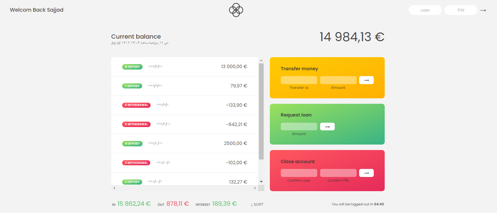

## Bankist

## See your Financial transactions!!

[Demo of Bankist](https://smsajjadsm.github.io/Bankist/)




Features

*   Creating a password and nickname to personalize the program
*   Show time and date according to your browser language
*   The ability to send and receive money and include it in the wallet
*   With a timer and closing the account in case of inactivity
*   Display the sum of inputs and outputs to the wallet
*   The ability to sort and insert the date of each transaction

### Not using local storage and erasing transactions for each refresh

## Installation

First clone project ...

```plaintext
https://github.com/SMsajjadSM/Bankist
```

Install the dependencies and devDependencies

```plaintext
npm i
```
#### userName : ss   &   password : 1111

#### How to support?

If you enjoyed and used this post,  
I would appreciate it if you could  
support me by giving me a ⭐

[SMsajjadSM](https://github.com/SMsajjadSM/Bankist)
